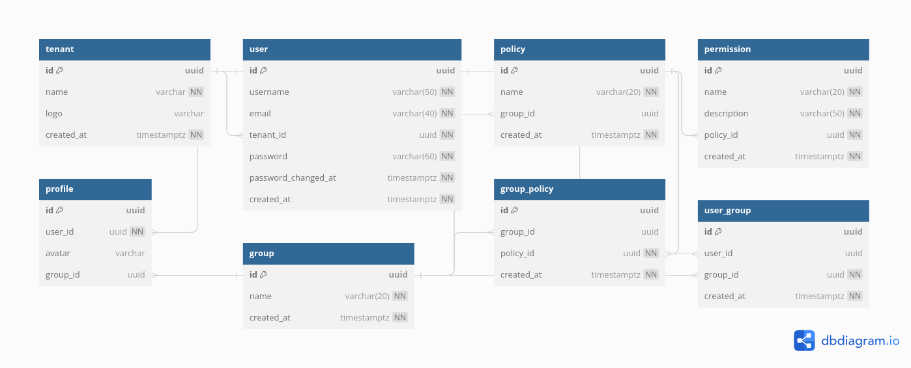

# go-multitenancy

Multi-tenancy application using Database-per-tenant model.

## Overview

- A new database is provisioned for each new tenant.
- The application tier is scaled up vertically by adding more resources per node.
- Or the app is scaled out horizontally by adding more nodes.
- The scaling is based on workload, and is independent of the number or scale of the individual databases.

## Customize for a tenant

The use of single-tenant databases gives strong tenant isolation. In any app whose model specifies only single-tenant databases, the schema for any one given database can be customized and optimized for its tenant. This customization does not affect other tenants in the app. Perhaps a tenant might need data beyond the basic data fields that all tenants need. Further, the extra data field might need an index.

With database-per-tenant, customizing the schema for one or more individual tenants is straightforward to achieve.

In such a case, a design to carefully manage schema customizations at scale should be taken into consideration.

## Comparisons

| Measurement                           | Standalone app                                   | Database-per-tenant                               | Sharded multi-tenant                                           |
| ------------------------------------- | ------------------------------------------------ | ------------------------------------------------- | -------------------------------------------------------------- |
| Scale                                 | Medium 1-100s                                | Very high 1-100,000s                         | Unlimited 1-1,000,000s                                    |
| Tenant isolation                      | Very high                                        | High                                              | Low; except for any single tenant (that is alone in an MT db). |
| Database cost per tenant              | High; is sized for peaks.                        | Low; pools used.                                  | Lowest, for small tenants in MT DBs.                           |
| Performance monitoring and management | Per-tenant only                                  | Aggregate + per-tenant                            | Aggregate; although is per-tenant only for singles.            |
| Development complexity                | Low                                              | Low                                               | Medium; due to sharding.                                       |
| Operational complexity                | Low-High. Individually simple, complex at scale. | Low-Medium. Patterns address complexity at scale. | Low-High. Individual tenant management is complex.             |

## Services

1. Auth
   - Handles authentication
2. Profile
   - Handles user profile
3. Other Services:
   - Groups : Manage groups which have multiple policies attached to.
   - Policies: Entities with permissions attached to which are attached to groups.
   - Permissions : Granular entities that control access to the tenant.

## Schema

- To update as more items are added

## Technologies

- Gin
- PostgreSQL
- Redis
- Docker
- Kubernetes
- SQLC
- Golang Migrate

## Future Implementation

- Replace Auth service implementation with an identity provider (Auth0 or Cognito)
- Expose both REST and gRPC endpoints using gRPC gateway.
- Re-do the project using Microservice Architecture.
- Attempt Sharded Multi-tenant approach.

## Reference

[Multi-tenant SaaS database tenancy patterns](https://learn.microsoft.com/en-us/azure/azure-sql/database/saas-tenancy-app-design-patterns?view=azuresql-db)

## Licence

[MIT Licence](./LICENSE)
